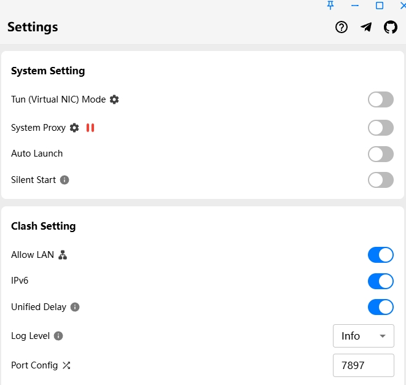

# oc-wsl-clash-proxy

> **让 OpenClaw 在 WSL2 自动跟随 Windows 代理分流策略。**  
> Keep WSL proxy in sync with your Windows host (Clash / Clash Verge / V2RayN / sing-box) with one command.

📘 **机制说明 / Mechanism Note**  
- 自动代理机制说明（中文）：[`refs/WSL_PROXY_MECHANISM.md`](refs/WSL_PROXY_MECHANISM.md)
- 使用指南（中文）：[`refs/USAGE.md`](refs/USAGE.md)
- Usage guide (English): [`refs/USAGE.en.md`](refs/USAGE.en.md)
- 重点：该机制由安装脚本注入 systemd 启动链（`ExecStartPre + EnvironmentFile`），并非 OpenClaw 默认内建行为。

📦 **统一安装位置 / Recommended Install Location**  
- 推荐目录：`~/.openclaw/workspace/skills/oc-wsl-clash-proxy`
- 必须用与 OpenClaw Gateway 相同的 Linux 用户执行（通常是当前登录用户）

```bash
mkdir -p ~/.openclaw/workspace/skills
cd ~/.openclaw/workspace/skills
git clone https://github.com/ljnjnc/oc-wsl-clash-proxy.git
cd oc-wsl-clash-proxy
bash scripts/enable_wsl_clash_proxy_service.sh
```


<p>
  <a href="#中文">中文</a> · <a href="#english">English</a>
</p>

---

## 中文

### 一句话

这是一个“省时间、少踩坑、稳常驻”的工具：
让 WSL 内 OpenClaw 自动跟随 Windows 主机代理，避免每次重启后手动修 IP / 端口 / 环境变量。

### 它解决的问题

- WSL 重启后网关 IP 漂移（`172.x.x.1` 变化）
- 代理端口变化导致偶发不可用
- 海外 API 可达性差、速度慢、偶发断连
- 下载资源慢且容易中断
- 手工维护 `HTTP(S)_PROXY` 容易出错

### 核心价值

- ✅ 自动探测主机 IP + 候选端口
- ✅ 保留 Windows 代理软件既有分流规则
- ✅ `ExecStartPre` 启动前刷新，常驻更稳
- ✅ 支持 `PROXY_URL` 固定覆盖，排障更快

### 适用人群

- OpenClaw 在 WSL2
- 代理软件在 Windows（Clash/Clash Verge/V2RayN/sing-box）
- 追求“稳定可用 + 少人工维护”

### 先决条件（重要）

- Windows 代理软件必须开启 **Allow LAN / 允许局域网连接**，否则 WSL 无法访问代理端口。

### Clash Verge 示例（Allow LAN）

1. 打开 Clash Verge → **Settings / General**
2. 找到 **Allow LAN / 允许局域网连接**
3. 确保开关为 **ON**


> 关键开关位置：右侧设置区域中的 **Allow LAN / 允许局域网连接**，请保持 **ON**。

### 30 秒开始

> 推荐先将仓库放到：`~/.openclaw/workspace/skills/oc-wsl-clash-proxy`

```bash
bash scripts/enable_wsl_clash_proxy_service.sh
```

### 可选参数

- `PROXY_URL`：固定代理 URL（最高优先级），例：`http://<WINDOWS_HOST_IP>:7890`
- `CLASH_PORT`：单端口优先（兼容旧参数）
- `PROXY_PORTS`：候选端口列表（逗号分隔）
- `SERVICE_NAME`：默认 `openclaw-gateway.service`

> 建议：默认走自动探测；仅在排障时使用固定 `PROXY_URL`。

### 验证

```bash
openclaw gateway status
systemctl --user status openclaw-gateway.service --no-pager
journalctl --user -u openclaw-gateway.service -n 120 --no-pager
```

### 一键健康检查（推荐）

```bash
bash scripts/oc-check.sh
```

### 回滚 / 卸载自动代理注入

```bash
bash scripts/disable_wsl_clash_proxy_service.sh
```

---

## English

### TL;DR

A reliability-first helper for OpenClaw on WSL2:
keep WSL proxy settings aligned with your Windows host proxy automatically.

### Problems it targets

- Host IP drift in WSL after reboot/network changes
- Proxy port drift across apps/modes
- Slow or unstable overseas API access
- Large downloads that are slow or fail midway
- Fragile manual `HTTP(S)_PROXY` maintenance

### What you get

- ✅ Auto-detect host IP + candidate ports
- ✅ Keep your existing Windows split-routing behavior
- ✅ Pre-start refresh (`ExecStartPre`) for stable systemd startup
- ✅ Debug fallback via fixed `PROXY_URL`

### Best for

- OpenClaw in WSL2
- Proxy app on Windows
- Long-running, low-maintenance workflows

### Prerequisite (important)

- Enable **Allow LAN / local network access** in your Windows proxy app, otherwise WSL cannot reach the proxy port.

### Clash Verge example (Allow LAN)

1. Open Clash Verge → **Settings / General**
2. Find **Allow LAN / local network access**
3. Keep the toggle **ON**



> Key toggle location: **Allow LAN / local network access** in the right settings panel, keep it **ON**.

### Quick Start

> Recommended repo path: `~/.openclaw/workspace/skills/oc-wsl-clash-proxy`
> See full usage guide: [`refs/USAGE.en.md`](refs/USAGE.en.md)

```bash
bash scripts/enable_wsl_clash_proxy_service.sh
```

### Optional parameters

- `PROXY_URL`: fixed proxy URL (highest priority), e.g. `http://<WINDOWS_HOST_IP>:7890`
- `CLASH_PORT`: preferred single port (legacy-compatible)
- `PROXY_PORTS`: comma-separated candidate ports
- `SERVICE_NAME`: default `openclaw-gateway.service`

### Verify

```bash
openclaw gateway status
systemctl --user status openclaw-gateway.service --no-pager
journalctl --user -u openclaw-gateway.service -n 120 --no-pager
```

### One-command health check (recommended)

```bash
bash scripts/oc-check.sh
```

### Rollback / disable auto-proxy injection

```bash
bash scripts/disable_wsl_clash_proxy_service.sh
```

---

## 开机后自动运行说明

- 该方案依赖 systemd user service。
- 若希望“未登录也后台运行”，请确认该用户已启用 linger：

```bash
loginctl show-user $USER -p Linger --value
# 若返回 no，可由管理员执行：
# sudo loginctl enable-linger $USER
```

## Notes

- Scope: **WSL native + systemd** workflow
- Docker / OnePanel needs dedicated adaptation
- Please comply with local laws and third-party ToS/AUP

## License

MIT (or repository default)
